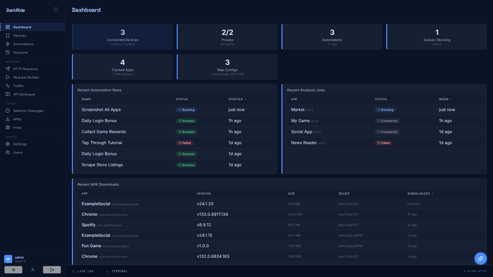
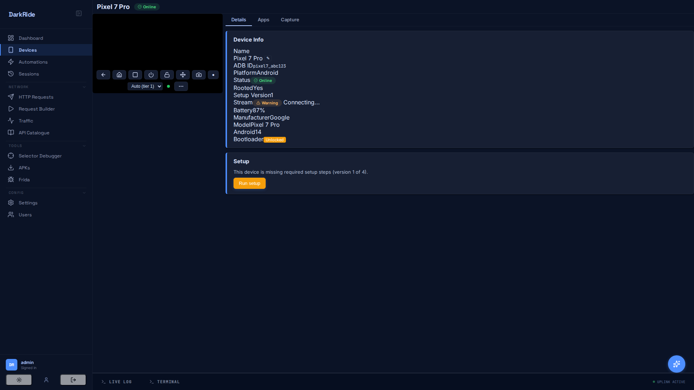
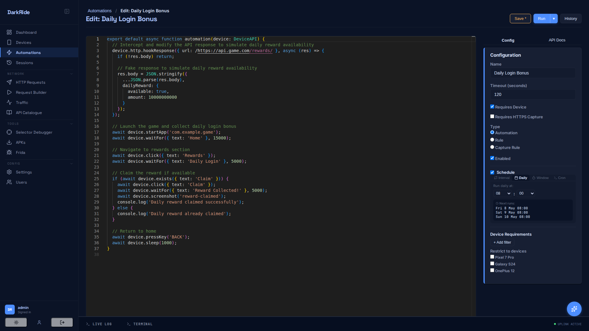
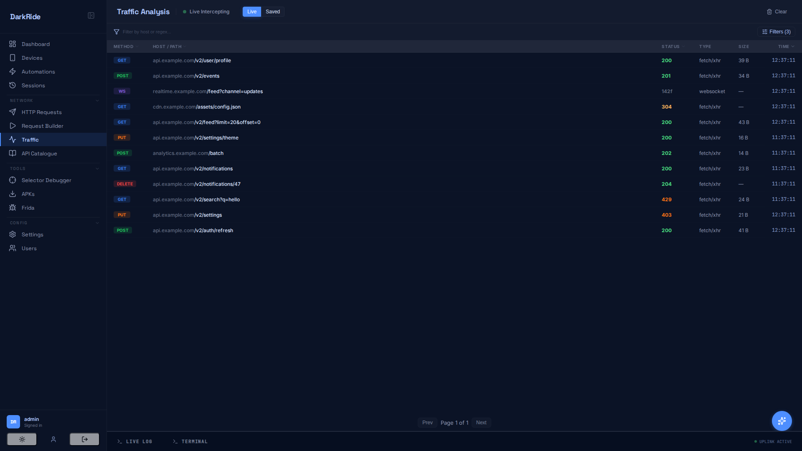
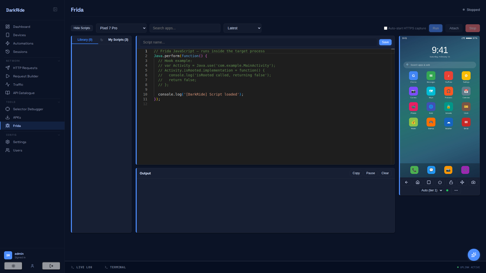
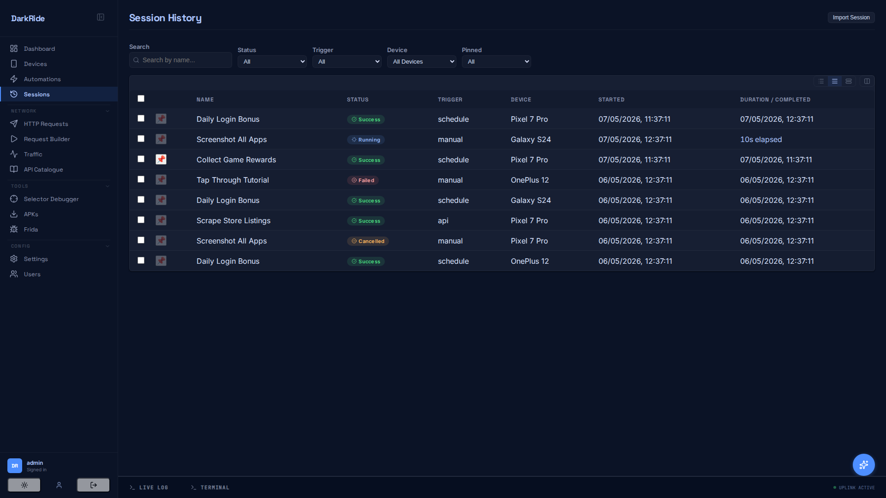

<div align="center">

  <picture>
    <source media="(prefers-color-scheme: dark)" srcset="brand/wordmark-dark.svg">
    
  </picture>

  <p><strong>An AI-native workbench for mobile reverse engineering.</strong></p>
  <p>For mobile pentesters, bug bounty hunters &amp; app reverse engineers.</p>

  <p>
    <a href="https://darkride.app">Website</a> ·
    <a href="#installation">Installation</a> ·
    <a href="ROADMAP.md">Roadmap</a> ·
    <a href="https://github.com/DarkRideApp/DarkRide/discussions">Discussions</a> ·
    <a href="https://darkride.app/pricing">Pro</a>
  </p>

  <p>
    <a href="LICENSE"></a>
    <a href="https://github.com/DarkRideApp/DarkRide/actions/workflows/ci.yml"></a>
    <a href="COMMERCIAL.md"></a>
  </p>

  

</div>

Self-hosted toolkit for Android device control, network traffic capture, APK analysis, and Frida instrumentation — all driven from a single web UI, with a TypeScript automation engine and a plugin system for extending it. iOS support is limited to USB device discovery and traffic capture today; screen control, automation, and Frida are Android-only ([see roadmap](ROADMAP.md)).

## Features

- **Live device control** — H.264 stream via scrcpy with WebCodecs decoding in the browser; adaptive bitrate (500 kbps–8 Mbps); adb-screencap fallback; hardware buttons; per-device proxy/TLS profile.
- **TypeScript automation engine** — Monaco editor with full `DeviceAPI` typings (click, scroll, getText, waitFor, DOM queries, HTTP); cron/HTTP triggers; rule system for popups; session history with logs, screenshots, and captured traffic; AI completion via Anthropic, Gemini, Ollama, OpenRouter, or Codestral.
- **HTTPS traffic capture** — WireGuard transparent proxy + mitmproxy; auto SSL injection on rooted devices; filter by device/method/status/host/path; domain block/hide lists; WebSocket capture with pluggable protocol decoders; TLS fingerprint spoofing (Chrome 120 Android).
- **Frida instrumentation** — In-browser IDE, script library, spawn/attach, live output; managed `frida-server` releases pushed to device; Frida Gadget injection for non-rooted devices; APK cache keyed on app/version/Frida version.
- **Proxy pool** — Health-monitored proxy rotation; NordVPN SOCKS5 per-country routing; server-side `device.httpGet/Post` helpers.
- **APK analysis** — Decompilation, resource extraction, React Native / Hermes bundle inspection, protobuf schema extraction, AI-powered version diffs, cross-device version tracking.
- **AI agent** — Page-aware chat with tool access; MCP server at `/mcp/sse`; auto-generated SKILL.md for the Claude Code CLI; REST `POST /v1/tools/{name}`; `ctx.tools` from automation scripts.
- **Plugin system** — Plugins register nav items, pages, API routes, AI tools, DB tables, jobs, settings, notification events, commands, protocol decoders, and plugin-to-plugin hooks. `darkride plugin create` scaffolds a new one. See [Plugin Authoring Guide](docs/plugins/README.md); `plugins/kitchen-sink/` exercises every extension point.
- **Session history & debugging** — Filter, pin, and replay automation runs; Selector Debugger for testing DOM queries against captured snapshots.

## Installation

### Prerequisites

Required:

- **Node.js 22+** (24 recommended) — backend runtime and build tooling
- **Python 3.12+** — used by the device, traffic, and APK bridges (`mitmproxy>=12.2.1` is the binding constraint)
- **ADB** (Android Platform Tools) — required to connect Android devices

Optional, per feature:

- **Java JDK 11+** — needed by the APK Analysis feature (jadx / apktool); the tools themselves auto-download on first use
- **WireGuard tools** (`wg`, `wg-quick`) — needed for HTTPS traffic capture on rooted Android
- **`xz`** (Linux/macOS) or **7-Zip** (Windows) — needed to decompress frida-server downloads on first Frida use

> DarkRide creates its Python venv (`.venv/`) and installs `python/requirements.txt` automatically on first start — you don't need to set those up manually. `frida-server`, `jadx`, and `apktool` binaries are downloaded on demand into `data/`.

### Docker (fastest — try without installing anything)

A prebuilt image is published to GitHub Container Registry on every push to `main`:

```bash
docker run -d --name darkride \
  -p 3000:3000 \
  -e HOST=0.0.0.0 \
  -e DARKRIDE_BOOTSTRAP_ADMIN_USERNAME=admin \
  -e DARKRIDE_BOOTSTRAP_ADMIN_PASSWORD="$(openssl rand -hex 16)" \
  -v darkride-data:/app/data \
  ghcr.io/darkrideapp/darkride:latest

docker logs darkride 2>&1 | grep -E "bootstrap|claim"   # find the admin password printed in logs
```

Open `http://localhost:3000/ui`. The container ships with Node 24 + Python 3.13 + `adb` + the mitmproxy/frida/pymobiledevice3 Python bridges, ready to talk to a USB-attached Android device once you mount it with `--device` (Linux hosts) or set up `adb connect` over the network.

Tags available: `:latest` follows main; `:sha-<7chars>` pins to a specific build for rollback.

### Install and Run (development)

```bash
# Clone and install Node dependencies
git clone https://github.com/DarkRideApp/DarkRide.git darkride
cd darkride
npm install

# Start development server (hot reload).
# First start creates .venv/ and pip-installs Python deps — takes ~1 minute.
npm run dev
```

Open http://localhost:5173/ui — connect Android devices via USB with USB debugging enabled. (iOS devices show up via USB but full feature support is Android-only today — see [roadmap](ROADMAP.md).)

### Production

```bash
npm run build
npm start    # serves on http://localhost:3000
```

DarkRide binds to `127.0.0.1` by default. Multi-user auth is built in (argon2id, scope-based RBAC, sessions, CSRF, optional API keys and OAuth providers). First boot prints a one-time claim URL to create the admin account, or use `DARKRIDE_BOOTSTRAP_ADMIN_*` env vars for unattended setup. Review [SECURITY.md](SECURITY.md) before exposing to non-trusted networks.

## Tech Stack

| Layer | Technology |
|-------|------------|
| Backend | TypeScript, Express, WebSockets |
| Frontend | React, Vite, Monaco Editor |
| Database | SQLite (better-sqlite3, Drizzle ORM) |
| Device control | scrcpy-server (H.264/WebCodecs), minicap, minitouch, uiautomator2 |
| Traffic capture | mitmproxy, WireGuard |
| Frida | frida-tools, Frida Gadget injection |
| AI completion | Anthropic, Gemini, Ollama, OpenRouter |
| Testing | Vitest, React Testing Library, supertest |

## Architecture

Single Node.js process: Express + WebSocket API → services → SQLite. Python bridges (`uiautomator2`, `mitmproxy`, `frida`) run as subprocesses managed from the backend. Frontend is a React SPA served by the same process in production.

See [docs/ARCHITECTURE.md](docs/ARCHITECTURE.md) for the full breakdown, and [docs/development.md](docs/development.md) for local development workflow.

## Documentation

**Getting started**

- [Development Guide](docs/development.md) — local dev workflow, multi-repo plugin setup, env vars
- [Environment Variables](docs/environment.md) — every `DARKRIDE_*` / runtime knob with defaults
- [Installing Plugins](docs/installing-plugins.md) — Marketplace UI, CLI, signing model
- [Troubleshooting](docs/troubleshooting.md) — common errors and what fixes them
- [Container Deployment](Dockerfile) — Dockerfile for running DarkRide containerised

**Plugin authoring**

- [Plugin Authoring Guide](docs/plugins/README.md) — overview, hello world, quick-reference table
  - [Lifecycle and ctx surface](docs/plugins/lifecycle.md)
  - [UI: nav, pages, slots](docs/plugins/ui.md)
  - [Backend: APIs, DB, tools, jobs, settings, hooks, files](docs/plugins/backend.md)
  - [Frontend wiring](docs/plugins/frontend.md)
  - [Testing](docs/plugins/testing.md)

**Reference**

- [REST API](docs/api.md) — endpoint listing for scripting against DarkRide
- [Architecture](docs/ARCHITECTURE.md) — high-level design, data flow, plugin model
- [Video streaming reliability](docs/video-streaming-reliability.md) — design notes for the H.264 pipeline

**Project**

- [Roadmap](ROADMAP.md)
- [Changelog](CHANGELOG.md)
- [Contributing](CONTRIBUTING.md)
- [Security policy](SECURITY.md)
- [Legal Notice](LEGAL.md)
- [Commercial / Pro / Consulting](COMMERCIAL.md)

## Screenshots

| | |
|---|---|
|  |  |
|  |  |
|  | |

## Contributing

Contributions welcome. See [CONTRIBUTING.md](CONTRIBUTING.md) for development setup, coding guidelines, and the PR process. By submitting a pull request, you agree to the [Contributor License Agreement](CLA.md).

## Funding

DarkRide is built and maintained by one developer. [DarkRide Pro](COMMERCIAL.md) supports continued development; commercial licensing and consulting are also available.

## License

[GNU Affero General Public License v3.0](LICENSE). Commercial licenses are available for organizations that need to use DarkRide without AGPL obligations — see [COMMERCIAL.md](COMMERCIAL.md).
